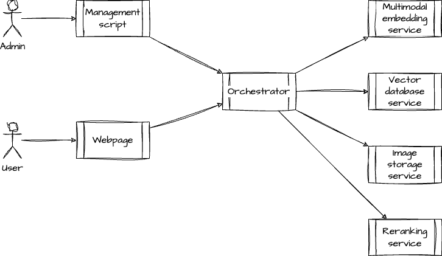

# Architecture

## Workflow

The following diagram shows the main workflow of the image search service.

- The core technology of image search service is based on high-dimensional vector search, which can be done easily with vector database.
- To generate high-dimensional vectors, aka embeddings, from images or natural language text, we use ViT (vision transformer) models and LLM (large language model).
- Embeddings are created then compared with existing images' embeddings to find similar images. A list of image URIs and their relevance scores are returned.
- Before directly serving the search result to the user, a re-ranking stage is added, to consider features beyond vector similarity such as diversity, user-feedback, popularity, and etc., for better user experience.

## Services

Here is a scaled-out version of the architecture that can support many users at the same time.

- **Gateways** are used for workload balancing;
- **Orchestrators** run the top-level business logic that interfaces with index / database / storage servers;
- **Index servers** run image and text indexing services, require powerful GPUs.
- **Database servers** run vector database services, require large memory.
- **Storage servers** store images, require large and fast disks.
- **Reranking servers** run reranking logic and database, require large memory and fast CPUs or maybe GPUs.

### Simplified version

Simplify the architecture for the demo purposes.

