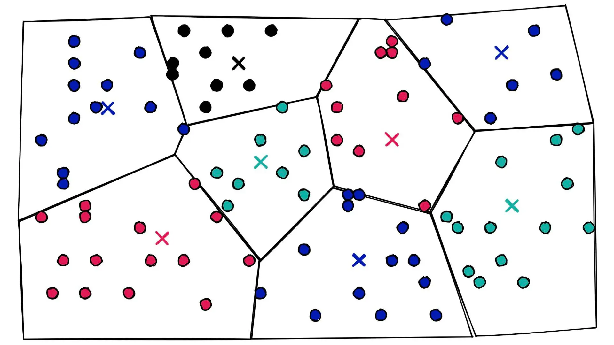
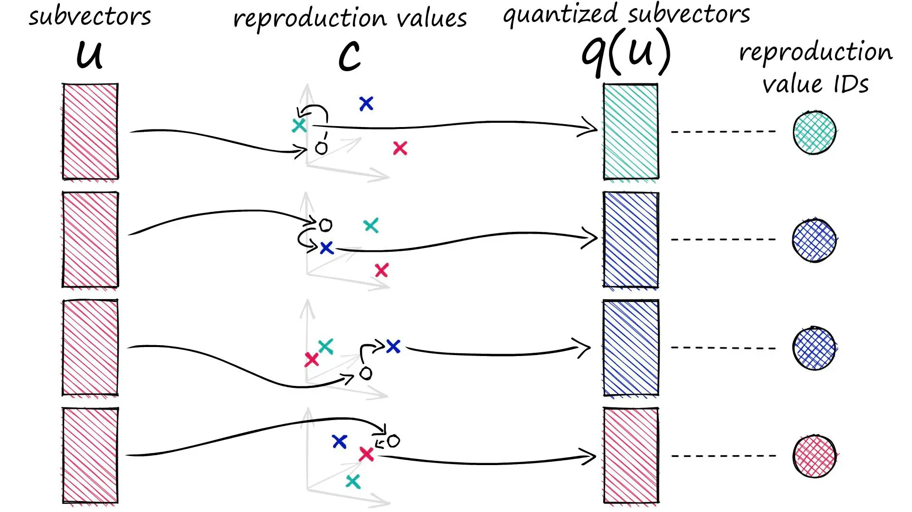
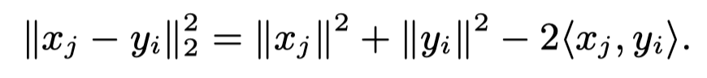
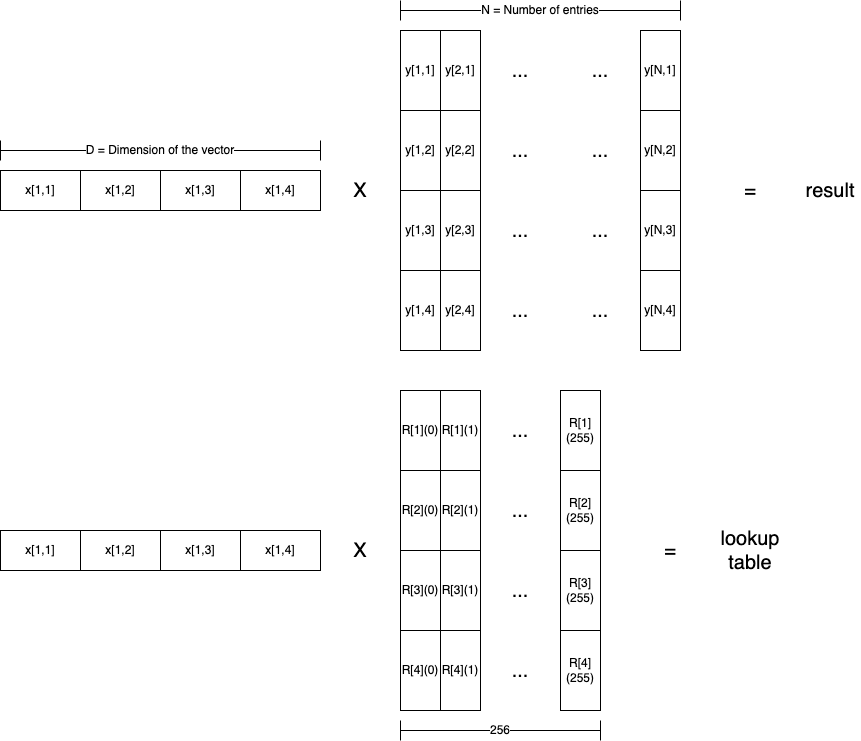
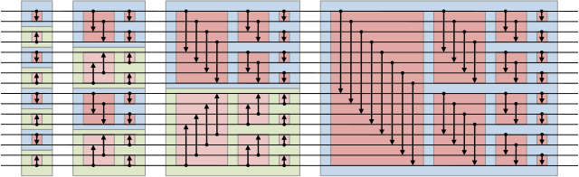
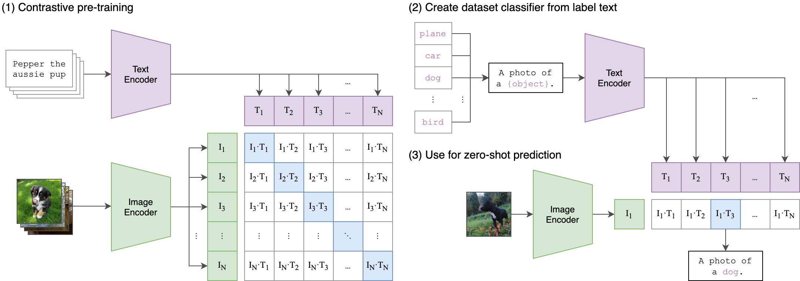

# FAISS: Similarity Search Library by Facebook AI

---

## Agenda

1.   Introduction: similarity search
2.   Deep dive: FAISS
3.   Beyond similarity search: vectorization

---

## Introduction: What is Similarity Search?

**Traditional seaching in databases**

-   Structured tables with fixed symbolic representation
-   Searching involves finding out the entries that matches the description

**Similarity seach**

-   Find similar entries of input multi-media / text / profile
-   Returns a list of entries that are nearest to the given query

---

## Introduction: Use-Cases of Similarity Search

-   Google's image search
-   Facebook's news feed
-   RAG: retrival augmented generation

---

## Introduction: How to Do Similarity Search

1.   Vectorization: convert both query and stored data entries into **high-dimensional vectors**
2.   Find the closest entires to the query by simply calculating the **Euclidean distance**

---

## Introduction: Challenges of Similarity Search
1.   Number of entires is super large: multiple billions
2.   Latency is critical for user experience
3.   How close / relevant are the returned results?

Therefore, 3 metrics of interest:

**Speed**, **memory usage** and **accuracy**

---

## Deep Dive: FAISS (Facebook AI Similarity Search)

**Open-source** library that supports quickly search  for multimedia documents.

Key ideas:

-   **Quantization**: memory usage and accuracy
-   **GPU acceleration**: speed

---

## Deep Dive: Quantization

### IVFADC

2-levels of indexing

-   Coarser quantization: **IVF (inverted file)**
    -   Groups the database entries into sub-domains.
    -   Non-exhaustive search: sacrifice accuracy for speed and memory usage.
-   Finer quantization: **ADC (asymmetric distance computation)**
    -   "Asymmetric": database vectors are compressed while query vectors are not.

---

## Deep Dive: Quantization

### Illustration of IVF

---

## Deep Dive: Quantization

### ADC: PQ (product quantization)

-   Evenly dissect vector into N sub-vectors
-   Quantize each sub-vector into 1-byte reproduction value ID
-   Concatenate N-byte results and store them

---

## Deep Dive: GPU Acceleration

### Batching

Euclidean distance calculation: X are the query vectors, Y are the stored database entries.

-   1st term: not needed before k-selection
-   2nd term: can be pre-calculated
-   3rd term: matrix multiplication

Batching ideas:

1.   Batching over the queries
2.   Tiling the Euclidean distance calculation

---

## Deep Dive: GPU Acceleration

### PQ (product quantization) lookup table

Use lookup table to replace expensive matrix multiplication

-   Before: DxN MACs
-   After: Dx256 MACs + NxB lookup add

---

## Deep Dive: GPU Acceleration

### Fast k-selection

[Bitonic sorting algorithm](https://en.wikipedia.org/wiki/Bitonic_sorter)

-   Can be easily parallelized
-   Can be done completely using GPU registers

---

## Deep Dive: GPU Acceleration

### WarpSelect

FAISS's implementation using CUDA

-   Single pass over data: memory bound problem
-   No cross-warp synchronization: minimize data exchange, maximize parallelism
-   Can deal with total number not equal to 2^N

---

## Deep Dive: GPU Acceleration

### Multi-GPU parallelism

**Replication**: replicate the same algorithm and target data across multiple GPUs, to parallelize different queries

**Sharding**: distribute target data across multiple GPUs and join the partial results in a single GPU

---

## Deep Dive: Summary

1. CUDA implementation of k-selection algorithm
    1. Parallelization
    2. In register compute
    3. Optimized memory access
2. Quantizations are used to trade-off speed against accuracy

---

## Beyond similarity search: vectorization

How to vectorize image?

-   Train the model with image classification task
-   Remove the last fully connected layer, and use output embedding

From CNN to ViT (vision transformer)

---

## Beyond similarity search: multimodality

### CLIP (Contrastive Language-Image Pre-training)

Mapping both text and image to the same vector space

-   [OpenCLIP](https://github.com/mlfoundations/open_clip) (open-source implementation of OpenAI's CLIP)

---

# QnA
